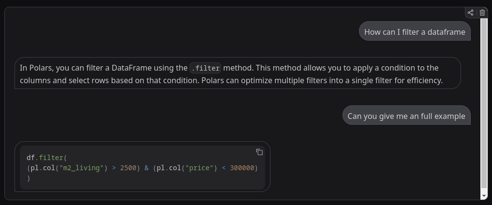

# 💬 Polars Python Chatbot

A Retrieval-Augmented Generation (RAG) chatbot powered by [LangGraph](https://www.langchain.com/langgraph) and [LangChain](https://www.langchain.com/), designed to answer questions about the [Polars](https://pola-rs.github.io/polars/) Python package. This chatbot uses a vector database built from official documentation to deliver accurate and concise responses about Polars.

### 🌐 Live Demo

Check out the live demo hosted on Hugging Face Spaces:  
#### 👉 [yeastcoast/polars-documentation-rag](https://huggingface.co/spaces/yeastcoast/polars-documentation-rag)

This deployment uses **Gemini Flash 2.0** as the chatbot LLM and a **Qdrant cluster** for storing the documentation embeddings.

---


## 🧠 Features

- 💬 Natural language interface to ask questions about Polars
- 🧾 Context-aware responses using RAG from documentation embeddings
- ⚡ Vector search with Qdrant
- 🤖 Gemini LLM integration via LangChain
- 🪄 Document chunking & semantic embeddings with HuggingFace Transformers
- 🖥️ Web interface via Gradio

---

## 📋 Table of Contents

- [Installation](#installation)
- [Configuration](#configuration)
- [Usage](#usage)
- [Architecture](#architecture)
- [Examples](#examples)
- [Troubleshooting](#troubleshooting)
- [License](#license)

---

## 🛠️ Installation

```bash
git clone https://github.com/your-username/polars-doc-chat.git
cd polars-doc-chat
pip install -r requirements.txt
```

---

## ⚙️ Configuration

Set the following environment variables:

```env
QDRANT_URL=https://your-qdrant-instance
QDRANT_API_KEY=your-qdrant-api-key
CHAT_API_KEY=your-google-api-key
```

---

## 🚀 Usage


To launch the chatbot UI:

```bash
python app.py
```


---

## 💡 Examples

Sample interaction:

> **User**: How do I filter a DataFrame in Polars?  

---

## 🛠 Dependencies

- `langchain`
- `langgraph`
- `transformers`
- `torch`
- `gradio`
- `qdrant_client`
- `markdown`
- `beautifulsoup4`
- `langchain_google_genai`

See [requirements.txt](requirements.txt) for full list.

---

## 🐛 Troubleshooting

- **Empty chatbot reply?** Make sure your API keys are correctly set.
- **Slow responses?** The rate limiter is set to 1 request every 4 seconds. Tune it in `rag_lanchain.py` if needed.
- **No results from Qdrant?** Check if your collection is created and populated properly.

---

## 📄 License

MIT License. See `LICENSE` file for more information.